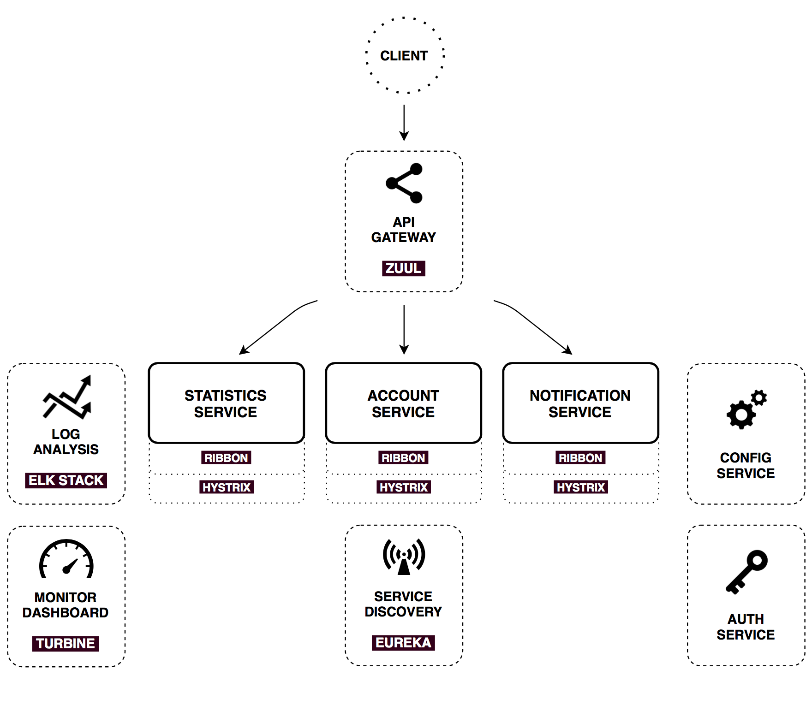

# spring-cloud-financial
实现一个真正的微服务实例。对应的业务为个人理财。
参考的架构和源码是：
https://github.com/sqshq/PiggyMetrics
我这里使用的是本机开发模式，作者的docker上运行的对初学者比较麻烦，我重新弄一个，顺便升级spring相关组件的版本。

整体架构图：


## 前置条件
首先我们要在本机安装mongodb和rabbitmq，这里我使用的是mac系统，简单两个命令搞定：

```
brew install mongodb
brew install rabbitmq
```

然后按照对应的提示把服务启动起来。

## config-server
首先创建微服务的配置中心项目

## registry-center
然后创建微服务注册服务中心项目

## api-gateway
接下来就是api网关项目了

## auth-service
再下来就是验证服务，其实有好多的坑，不知道是否是版本问题，但是后面我填了。这里需要用到mongodb存储。

## account-service
这个服务建立好后我们其实就可以先测试一把了。

## monitoring
可以把这个监控的弄起来了。这里需要用到rabbitmq这种默认的消息队列，当然也可以改成kafka等其他的。
http://localhost:8989/turbine/turbine.stream

## statistics-service
这里注意要用到外网的货币转换服务，所有请注意联网，否则有些功能有问题的。

## notification-service
通知服务，这里可以不需要，其实就是发邮件通知吧，可以改成你需要通知模式。


至此，所有的服务功能示例都已经完成，可能还存在隐含的问题，我后续持续跟进。
按照图里面所有理念是非常好的。
测试通过的是account-service(包括)之前的所有服务。
后面几个还有问题，statistics-service和notification-service还是安全验证等的问题，其他都是小问题。
现在最大的问题是monitoring；之前我没有用spring-cloud-starter-turbine-stream，只用了spring-cloud-starter-turbine，并且跟dashboard
是分开使用的，现在集成在一起用，在网上也没找到对应的实例，比较麻烦，作者的原样配置根本不行，这个跟spring的auth2验证一样，那个问题我已经通过
源码调试和尝试解决了，这个得再看看。有必要还得看源码，暂时还没解决。请知。

注意：
> 我还是和很多人那样的意见，spring-security-oauth2感觉是里面的一个失败品(或者说至少是未完成品)，巨坑。
> 在正式使用的时候我还是建议大家尽量避免这个东西，宁愿按照对应的架构理念另外实现一套，或者直接集成你原来比较简单验证系统。
> 我在弄这个微服务架构实现过程其实大部分时间都是在解决spring-security-oauth2的问题，其他的问题基本没有或相当简单。
> 不管怎么说原作者的理念和对应的方式跟官方培训的非常解决一致，所有还是非常好的，随便稍加改造就可以直接使用和上生产。